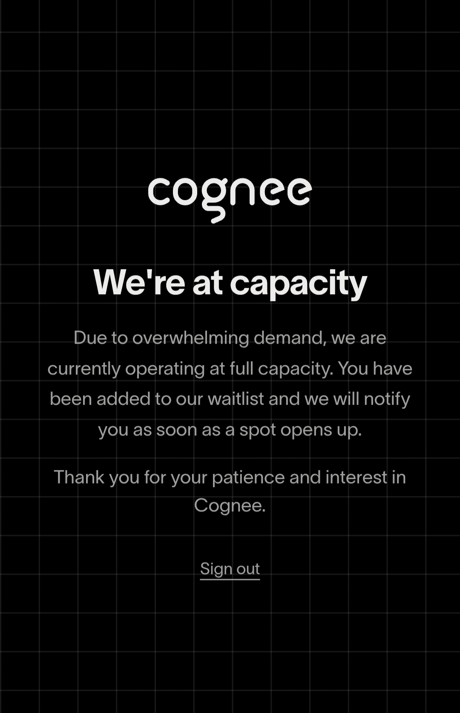

# Cognee Cloud — the rate-limit escape hatch, and how it actually got wired in

## The story first, because it explains why this exists

The first time I actually tried to use Cognee Cloud — specifically because
Groq's free tier kept running out mid-ingest — it didn't work at all.
Trying to connect just returned a **"we are at capacity"** error, with a
`COGNEE-35` code attached. No queue, no ETA, just a flat "not right now."
At that point I assumed Cloud simply wasn't an option for this project and
moved on, sticking with Groq/Gemini rate-limit workarounds instead.

Capacity apparently came back on **July 2**, but I didn't find that out
until **end of day on July 3** — I just wasn't watching for it, since I'd
already written it off. So there were roughly one and a half days where
Cloud was actually available and I didn't know it. Once I did find out, the
rest of this doc is what came out of actually trying to wire it in as a
fix for the Groq/Gemini rate-limit pain instead of just another rewrite of
the self-hosted pipeline.



---

## What Cloud is, in this project's terms

Cognee 1.0 ships a managed hosted option — `cognee.serve(url=..., api_key=...)`
— that routes the same `add()` / `cognify()` / `recall()` / `improve()` /
`forget()` calls through Cognee's own infrastructure instead of the local
SQLite/LanceDB/Kuzu stack this project uses by default. The appeal is
specific: managed compute might sidestep the free-tier rate-limit ceiling
that's the whole reason Fast Vector Mode exists as a fallback in the first
place (see `COGNEE.md` Section 4).

The risk was just as specific: swapping the pipeline that actually works
for something untested, days before a deadline, is exactly the kind of
change that breaks a working demo for an unproven upside. So it's wired in
as **fully additive and opt-in**, never a replacement for the self-hosted
path.

---

## How it's actually wired (the honest version, including what broke)

All of this lives in `_maybe_connect_cloud()` in
`backend/app/services/cognee_service.py`.

**The gate**: it only attempts anything if **both** `COGNEE_CLOUD_URL` and
`COGNEE_API_KEY` are set. Neither is set on the current Render deployment
— so today, this function returns `False` immediately and changes nothing.
The app runs exactly as documented in `COGNEE.md`, full stop.

**The first real test — and the gap it caught**: the first time this ran
against an actual Cloud instance, `cognee.serve()` logged `"Connected"`.
That looked like success. It wasn't — the very next real call
(`cognee.add()`) failed on every single chunk. Cognee routes *all*
subsequent operations to the remote client unconditionally once one
exists, so nothing caught the failure — the promised "falls back
automatically" behavior simply didn't fire, because the actual failure
happened one step later than where the safety net was checking.

**The fix**: `_maybe_connect_cloud()` doesn't trust `serve()` returning
without raising as proof of anything. Right after connecting, it runs one
real, cheap operation —
`cognee.remember("Lore cloud connectivity check", dataset_name="_lore_cloud_healthcheck")`
— wrapped in a 20-second timeout so an unreachable host fails fast instead
of hanging the whole ingest request. Only if *that* succeeds does it mark
the connection as trusted:

```python
await cognee.serve(url=settings.COGNEE_CLOUD_URL, api_key=settings.COGNEE_API_KEY)
# "Connected" alone is not proof — verify with a real call:
await asyncio.wait_for(
    cognee.remember("Lore cloud connectivity check", dataset_name="_lore_cloud_healthcheck"),
    timeout=20,
)
```

If the verification call fails for any reason, it explicitly calls
`cognee.disconnect()` and reverts to the self-hosted pipeline **before any
real ingestion touches the remote client** — logging a warning once, never
raising. A broken Cloud connection is non-fatal by design; it can't take
down ingestion or chat.

**When it's attempted**: once per process, inside `setup()` — not once per
request — since `cognee.serve()` opens a persistent connection rather than
something to redo on every call. `cloud_status()` exposes
`{"attempted": bool, "connected": bool}` for introspection if you want to
surface it in a health check.

---

## How to actually try it

1. Set `COGNEE_CLOUD_URL` and `COGNEE_API_KEY` in your **local** `.env`
   first. Never directly in Render's dashboard until it's been tested —
   this is the one rule worth not skipping, given the capacity-error
   history above; there's no guarantee Cloud behaves identically the next
   time you reach for it.
2. Run a Full Graph Mode ingest locally against a small repo.
3. Watch the logs for one of two outcomes:
   - `"[COGNEE] Verified — Cognee Cloud is live at ..."` → it worked, and
     everything downstream (add/cognify/recall/improve/forget) is now
     going through Cloud instead of the local stack.
   - The fallback warning → it didn't work, and you're transparently back
     on the self-hosted pipeline with no other side effects.
4. Only promote the env vars to Render once you've confirmed real
   behavior against a real repo, not just that `serve()` didn't throw.

### Known local gotcha: SSL certificate errors on macOS

If you see `SSLCertVerificationError: unable to get local issuer
certificate` when connecting, this is almost always a local Python
installation issue, not a Cognee Cloud problem — specifically common with
Python installed via the official python.org macOS installer, which
doesn't hook into the system keychain for root certificates by default.

```bash
open "/Applications/Python 3.14/Install Certificates.command"
```

or, if that file doesn't exist for your version:

```bash
pip install --upgrade certifi
export SSL_CERT_FILE=$(python3 -m certifi)
export REQUESTS_CA_BUNDLE=$(python3 -m certifi)
```

---

## Current state, plainly

- Cloud is **not** configured on the deployed Render backend. The 512MB
  OOM issue on Render's free tier and the Groq daily-token-limit issue are
  both still handled by the self-hosted pipeline + Fast Vector Mode
  fallback, not by Cloud.
- Cloud remains a real option worth revisiting — the appeal (managed
  compute, no local rate-limit ceiling) is unchanged — but given it was
  already unavailable once with no warning (`COGNEE-35`, "at capacity"),
  I'm treating it as something to test fresh each time before depending on
  it, not something to assume is up.
- If you pick this back up: local-test first per the steps above, confirm
  the verification call actually passes, and only then consider whether
  moving Render's env vars over is worth the risk this close to (or after)
  a deadline.
