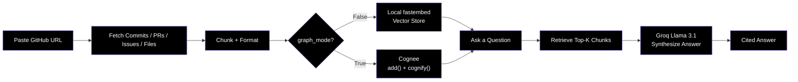
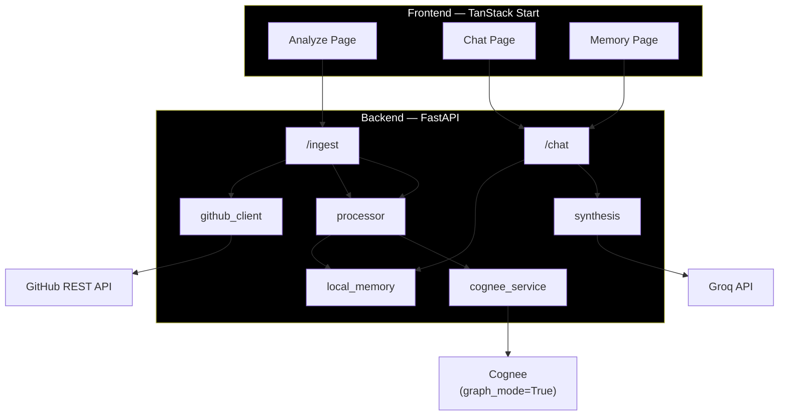

<div align="center">

# 📖 Lore

### *AI-Powered Codebase Memory — Your Repo, Finally Explaining Itself*

[](https://github.com/laypatel13/lore)
[](#)

<br/>

[](https://fastapi.tiangolo.com)
[](https://python.org)
[](https://react.dev)
[](https://vitejs.dev)
[](https://tanstack.com/start)
[](https://cognee.ai)
[](https://groq.com)

<br/>

**Lore** ingests a GitHub repository's entire history — commits, PRs, issues, and source files — into a queryable memory layer, then lets developers ask *why* the code is the way it is and get a cited, synthesized answer instead of a wall of grep results.

Built for the **WeMakeDevs "Hangover Part AI" Hackathon**.

<br/>

[📖 API Reference](#-api-reference) · [🚀 Quick Start](#-quick-start) · [🗂️ Project Structure](#️-project-structure) · [🐛 Report Bug](https://github.com/laypatel13/lore/issues)

</div>

---

## 📋 Table of Contents

- [🎯 The Mission](#-the-mission)
- [✨ Key Features](#-key-features)
- [🔬 How It Works](#-how-it-works)
- [🏗️ System Architecture](#️-system-architecture)
- [🛠️ Tech Stack](#️-tech-stack)
- [🚀 Quick Start](#-quick-start)
- [📊 API Reference](#-api-reference)
- [🗂️ Project Structure](#️-project-structure)
- [🤝 Contributing](#-contributing)
- [📜 License](#-license)

---

## 🎯 The Mission

<table>
<tr>
<td width="60%">

### GitHub stores your history. Lore remembers why it happened.

- **Ingest** any public repo's full commit, PR, and issue history in one call.
- **Ask** plain-English questions about past decisions and get a synthesized answer with sources.
- **Switch** between a fast, rate-limit-free local vector mode and a full Cognee knowledge-graph mode.
- **Inspect** live ingestion stats — files, chunks, commits, PRs, issues — while a job runs.
- **Forget** a repo's memory on demand instead of letting context pile up forever.

> *"Every commit hides a decision. Every PR buries a reason. Lore makes that history queryable."*

</td>
</tr>
</table>

---

## ✨ Key Features

<table>
<tr>
<td align="center" width="33%">
<h3>📥 Full-History Ingestion</h3>
<p>Pulls commits, pull requests, issues, and every source file from a public GitHub repo via the REST API.</p>
</td>
<td align="center" width="33%">
<h3>🧠 Cited Synthesis</h3>
<p>Retrieved chunks are passed to Llama 3.1 8B (via Groq) to produce a clean prose answer with source citations, not raw fragments.</p>
</td>
<td align="center" width="33%">
<h3>⚡ Fast Mode by Default</h3>
<p>Local <code>fastembed</code> embeddings + cosine similarity — zero LLM calls for retrieval, no rate limits, reliable for live demos.</p>
</td>
</tr>
<tr>
<td align="center" width="33%">
<h3>🕸️ Full Graph Mode</h3>
<p>Optional <code>graph_mode=True</code> routes ingestion through Cognee's real <code>add()</code> + <code>cognify()</code> pipeline for true graph extraction.</p>
</td>
<td align="center" width="33%">
<h3>📈 Live Job Status</h3>
<p>Poll ingestion status mid-run — files discovered, chunks generated, docs stored, and per-source counts update in real time.</p>
</td>
<td align="center" width="33%">
<h3>🗑️ Memory Lifecycle</h3>
<p>Query, enrich (<code>improve()</code>), and forget a repo's memory independently — nothing sticks around longer than you want it to.</p>
</td>
</tr>
</table>

---

## 🔬 How It Works



---

## 🏗️ System Architecture

Lore is split into a stateless FastAPI service and a TanStack Start (React) frontend, talking over a small REST surface. Ingestion runs as a background task so the UI can poll status without blocking.



---

## 🛠️ Tech Stack

### Frontend
| Technology | Purpose |
|:---|:---|
|  | UI framework with modern hooks |
|  | File-based routing + SSR |
|  | Lightning-fast build tool |
|  | Accessible UI primitives |
|  | Type-safe app code |

### Backend
| Technology | Purpose |
|:---|:---|
|  | Runtime environment |
|  | High-performance API framework |
|  | Knowledge graph + memory layer |
|  | Local, dependency-light embeddings |
|  | Async HTTP client for GitHub/Groq |

### External Services
| Technology | Purpose |
|:---|:---|
|  | Source of commits, PRs, issues, files |
|  | Llama 3.1 8B Instant — answer synthesis |

---

## 🚀 Quick Start

### Prerequisites

- Python 3.11 or higher
- Node.js 20 or higher
- A Groq API key ([console.groq.com](https://console.groq.com))
- (Optional) A Cognee API key for Full Graph Mode

### 1️⃣ Backend Setup

```bash
cd backend
```
```bash
python -m venv .venv
```
```bash
source .venv/bin/activate        # Windows: .venv\Scripts\activate
```
```bash
pip install -r requirements.txt
```
```bash
cp .env.example .env
```

**Configure `.env`**:
```text
GITHUB_TOKEN = your_github_token

GROQ_API_KEY = your_groq_key

COGNEE_API_KEY = your_cognee_key

COGNEE_SKIP_CONNECTION_TEST = true

APP_ENV = development
```

**Start the backend**:
```bash
uvicorn app.main:app --reload --port 8000
```
The backend will run at `http://localhost:8000`. Interactive docs are available at `http://localhost:8000/docs`.

### 2️⃣ Frontend Setup

```bash
cd frontend
```
```bash
npm install
```

**Start the frontend**:
```bash
npm run dev
```
The frontend will run at `http://localhost:3000`.

### 3️⃣ Try It

1. Open the **Analyze** page and paste a public GitHub repo URL.
2. Leave **Graph Mode** off for the fast, demo-reliable local vector pipeline.
3. Once ingestion completes, open **Chat** and ask something like *"Why was the auth flow rewritten?"*

---

## 📊 API Reference

| Method | Endpoint | Description |
|--------|----------|-------------|
| `POST` | `/ingest/` | Start ingesting a repo (commits, PRs, issues, files) as a background job |
| `GET` | `/ingest/{repo_id}/status` | Poll live ingestion status and counts |
| `POST` | `/chat/query` | Ask a question about an ingested repo's memory |
| `POST` | `/chat/improve` | Enrich the knowledge graph (Full Graph Mode only) |
| `DELETE` | `/chat/forget` | Remove a repo's memory entirely |
| `GET` | `/chat/memory/{repo_id}` | Get aggregate memory stats for a repo |

---

## 🗂️ Project Structure

```text
lore/
│
├── backend/                          # FastAPI backend service
│   ├── app/
│   │   ├── main.py                   # App entry point, registers all routers
│   │   ├── core/
│   │   │   └── config.py             # Environment variables and settings
│   │   ├── models/
│   │   │   └── schemas.py            # Pydantic request/response models
│   │   ├── api/
│   │   │   └── routes/
│   │   │       ├── ingest.py         # POST /ingest, GET /ingest/{id}/status
│   │   │       └── chat.py           # POST /chat/query, improve, forget, memory stats
│   │   └── services/
│   │       ├── github_client.py      # GitHub REST API fetching
│   │       ├── processor.py          # Chunking and metadata formatting
│   │       ├── cognee_service.py     # Cognee setup + add/search wrapper
│   │       ├── local_memory.py       # fastembed + cosine-sim fast path
│   │       └── synthesis.py          # Groq call that turns chunks into an answer
│   ├── local_memory_store/           # Runtime-generated embeddings (gitignored)
│   ├── requirements.txt
│   └── .env.example
│
└── frontend/                         # TanStack Start (React) frontend
    ├── src/
    │   ├── main.tsx                  # Client entry point
    │   ├── router.tsx                # Router instance
    │   ├── routes/                   # File-based routes
    │   │   ├── index.tsx             # Landing page route
    │   │   ├── analyze.tsx           # Repo ingestion route
    │   │   ├── chat.$repoId.tsx      # Chat-with-repo route
    │   │   └── memory.$repoId.tsx    # Memory/graph view route
    │   ├── pages/                    # Page-level components
    │   │   ├── LandingPage.tsx
    │   │   ├── AnalyzePage.tsx
    │   │   ├── ChatPage.tsx
    │   │   └── MemoryPage.tsx
    │   ├── components/
    │   │   ├── layout/                # NavBar etc.
    │   │   └── ui/                    # shadcn/ui primitives
    │   ├── api/
    │   │   └── client.ts              # Backend API client
    │   ├── lib/                       # Utilities, router shim, SSR error handling
    │   └── styles/                    # Design tokens
    ├── package.json
    └── components.json
```

---

## 📜 License

This project is licensed under the **MIT License**.