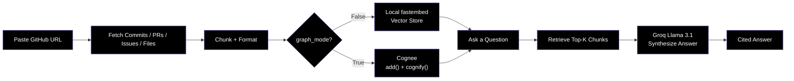

<div align="center">

<br/>

**Your Repo, Finally Explaining Itself.**

[](https://github.com/laypatel13/lore)
[](https://lore-demo.vercel.app)
<br/>
[](https://fastapi.tiangolo.com)
[](https://python.org)
[](https://react.dev)
[](https://cognee.ai)
[](https://groq.com)
<br/>

**Lore** ingests a GitHub repository’s entire history — commits, PRs, issues, and source files — into a queryable memory layer. Ask *why* the code is the way it is and get cited, synthesized answers instead of grep walls.

Built for the **WeMakeDevs "Hangover Part AI" Hackathon**.
</div>

---

## 📋 Table of Contents

- [🎯 The Mission](#-the-mission)
- [✨ Key Features](#-key-features)
- [🔬 How It Works](#-how-it-works)
- [🏗️ System Architecture](#️-system-architecture)
- [🛠️ Tech Stack](#️-tech-stack)
- [🚀 Quick Start](#-quick-start)
- [📊 API Reference](#-api-reference)
- [🗂️ Project Structure](#️-project-structure)
- [🤝 Contributing](#-contributing)
- [📜 License](#-license)

---

## 🎯 The Mission

**GitHub stores your history. Lore remembers *why* it happened.**

- Ingest any public repo’s full commit, PR, issue, and file history in one go.
- Ask plain-English questions about past decisions and get clean, cited answers.
- Switch between **Fast Vector Mode** (reliable demos) and **Full Graph Mode** (Cognee-powered knowledge graph).
- Inspect live ingestion stats and explore the memory graph.
- Forget a repo’s memory on demand.

> *"Every commit hides a decision. Every PR buries a reason. Lore makes that history queryable."*

---

## ✨ Key Features

| Feature | Description |
|---------|-------------|
| **📥 Full-History Ingestion** | Pulls commits, PRs, issues, and every source file via GitHub API. |
| **🧠 Cited Synthesis** | Groq Llama 3.1 turns retrieved chunks into clean prose with sources. |
| **⚡ Fast Mode (Default)** | Local `fastembed` + cosine similarity — zero LLM calls for retrieval. |
| **🕸️ Full Graph Mode** | Optional Cognee `add()` + `cognify()` for real entity-relationship graphs. |
| **📈 Live Job Status** | Real-time polling of files, chunks, commits, PRs, and issues. |
| **🗑️ Memory Lifecycle** | Query, improve, and forget independently. |

---

## 🔬 How It Works



---

# 🏗 Architecture

```text
┌──────────────────────────┐
│        Frontend          │
│ React + TanStack Start   │
└────────────┬─────────────┘
             │
             ▼
┌──────────────────────────┐
│        FastAPI API       │
│  Ingestion & Retrieval   │
└────────────┬─────────────┘
             │
    ┌────────┴────────┐
    │                 │
    ▼                 ▼
 Vector Store     Cognee Graph
 (Fast Mode)      (Graph Mode)

             │
             ▼
       Groq LLM Layer
             │
             ▼
      Synthesized Answers
```

---

# 🛠 Tech Stack

## Frontend

| Technology | Purpose |
|------------|----------|
| React 18 + TanStack Start | Modern file-based routing + SSR |
| Vite | Lightning-fast builds |
| shadcn/ui + Tailwind CSS | Beautiful, accessible UI components |
| TypeScript | Type safety and developer experience |

## Backend

| Technology | Purpose |
|------------|----------|
| FastAPI | High-performance API framework |
| Cognee | Knowledge graph + memory layer |
| FastEmbed | Local embeddings for Fast Mode |
| HTTPX | Async GitHub and Groq client |

## External Services

| Technology | Purpose |
|------------|----------|
| GitHub REST API | Fetch commits, PRs, issues, and files |
| Groq (Llama 3.1) | Repository answer synthesis |
| Ollama (Optional) | Local LLM support for Graph Mode |

---

# 🚀 Quick Start
## Prerequisites

- Python 3.11+
- Node.js 20+
- Groq API key
- (Optional) Ollama for local Full Graph Mode

### 1️⃣ Backend

```bash
cd backend
```
```bash
python -m venv venv 

source venv/bin/activate
```
```bash
pip install -r requirements.txt
```
```bash
cp .env.example .env
```

### 2️⃣ Frontend

```bash
cd frontend
```
```bash
npm install
```
```bash
npm run dev
```
- Open http://localhost:3000 → Analyze → paste a public repo URL.
- Pro tip: Leave Graph Mode off for instant, reliable demos.

---

## 📊 API Reference

| Method | Endpoint | Description |
|---------|----------|-------------|
| `POST` | `/ingest/` | Start repository ingestion as a background job. |
| `GET` | `/ingest/{repo_id}/status` | Retrieve live ingestion progress and job status. |
| `POST` | `/chat/query` | Ask questions about the repository memory. |
| `POST` | `/chat/improve` | Enrich and refine the knowledge graph (Full Graph Mode). |
| `DELETE` | `/chat/forget` | Delete a repository's stored memory. |
| `GET` | `/chat/memory/{repo_id}` | View memory statistics and ingestion metrics. |
| `GET` | `/chat/graph/{repo_id}` | Retrieve the generated Cognee knowledge graph (Graph Mode only). |

### Example Workflow

```text
1. POST   /ingest/
   └─ Ingest a GitHub repository

2. GET    /ingest/{repo_id}/status
   └─ Monitor ingestion progress

3. POST   /chat/query
   └─ Ask questions about repository history

4. POST   /chat/improve
   └─ Enhance graph relationships (optional)

5. GET    /chat/memory/{repo_id}
   └─ Inspect stored memory statistics

6. GET    /chat/graph/{repo_id}
   └─ Visualize the knowledge graph

7. DELETE /chat/forget
   └─ Remove repository memory
```

---

## 🗂️ Project Structure

```text
lore/
│
├── README.md
├── LICENSE
├── .gitignore
├── .env.example
│
├── backend/
│   │
│   ├── requirements.txt
│   ├── pyproject.toml
│   ├── .env.example
│   │
│   ├── app/
│   │   │
│   │   ├── main.py
│   │   │
│   │   ├── core/
│   │   │   ├── config.py
│   │   │   ├── constants.py
│   │   │   └── logging.py
│   │   │
│   │   ├── models/
│   │   │   └── schemas.py
│   │   │
│   │   ├── api/
│   │   │   ├── __init__.py
│   │   │   └── routes/
│   │   │       ├── ingest.py
│   │   │       └── chat.py
│   │   │
│   │   ├── services/
│   │   │   ├── github_client.py
│   │   │   ├── processor.py
│   │   │   ├── cognee_service.py
│   │   │   ├── local_memory.py
│   │   │   ├── synthesis.py
│   │   │   ├── embeddings.py
│   │   │   └── retrieval.py
│   │   │
│   │   └── utils/
│   │       ├── chunking.py
│   │       ├── formatting.py
│   │       └── helpers.py
│   │
│   └── local_memory_store/
│       └── (gitignored)
│
├── frontend/
│   │
│   ├── package.json
│   ├── vite.config.ts
│   ├── tsconfig.json
│   ├── components.json
│   │
│   ├── public/
│   │   ├── favicon.ico
│   │   └── logo.svg
│   │
│   └── src/
│       │
│       ├── routes/
│       │   ├── __root.tsx
│       │   ├── index.tsx
│       │   ├── ingest.tsx
│       │   ├── query.tsx
│       │   └── graph.tsx
│       │
│       ├── pages/
│       │   ├── Home.tsx
│       │   ├── Dashboard.tsx
│       │   ├── QueryPage.tsx
│       │   └── GraphPage.tsx
│       │
│       ├── components/
│       │   ├── Navbar.tsx
│       │   ├── Footer.tsx
│       │   ├── Hero.tsx
│       │   ├── RepoForm.tsx
│       │   ├── QueryBox.tsx
│       │   ├── AnswerCard.tsx
│       │   ├── StatusCard.tsx
│       │   ├── GraphViewer.tsx
│       │   └── MemoryStats.tsx
│       │
│       ├── hooks/
│       │   ├── useIngestion.ts
│       │   ├── useQuery.ts
│       │   └── useMemory.ts
│       │
│       ├── lib/
│       │   ├── api.ts
│       │   └── utils.ts
│       │
│       └── styles/
│           └── globals.css
│
└── docs/
    ├── architecture.md
    ├── api-reference.md
    └── screenshots/
```

### Backend Highlights


- **github_client.py** — Fetches commits, pull requests, issues, and repository files.
- **processor.py** — Cleans, chunks, and formats repository data.
- **local_memory.py** — Fast vector-based memory store using embeddings.
- **cognee_service.py** — Handles Cognee graph ingestion and retrieval.
- **synthesis.py** — Uses Groq Llama 3.1 to generate cited answers.


### Frontend Highlights


- **RepoForm** — Repository ingestion form.
- **QueryBox** — Natural-language query interface.
- **AnswerCard** — Displays synthesized answers with citations.
- **StatusCard** — Real-time ingestion progress.
- **GraphViewer** — Visualizes repository knowledge graphs.
- **MemoryStats** — Displays repository memory metrics.

---

## 📜 License

This project is licensed under the MIT License. See the `LICENSE` file for details.

---

<div align="center">

Built with ❤️ for the **WeMakeDevs "Hangover Part AI" Hackathon**

**GitHub stores your history. Lore remembers why it happened.**

⭐ If you found Lore interesting, consider starring the repository.

</div>