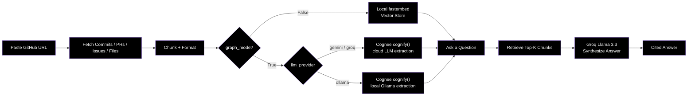

<div align="center">

<br/>

**Your Repo, Finally Explaining Itself.**

[](https://github.com/laypatel13/lore)
[](https://lore-psi-inky.vercel.app)
<br/>
[](https://fastapi.tiangolo.com)
[](https://python.org)
[](https://react.dev)
[](https://tanstack.com/start)
[](https://cognee.ai)
[](https://groq.com)
<br/>

**Lore** ingests a GitHub repository’s entire history — commits, PRs, issues, and source files — into a queryable memory layer. Ask *why* the code is the way it is and get cited, synthesized answers instead of grep walls.

Built for the **WeMakeDevs "Hangover Part AI" Hackathon**.

<br/>


</div>

---

## 📋 Table of Contents

- [🎯 The Mission](#-the-mission)
- [✨ Key Features](#-key-features)
- [🔬 How It Works](#-how-it-works)
- [🏗️ System Architecture](#️-system-architecture)
- [🛠️ Tech Stack](#️-tech-stack)
- [🚀 Quick Start](#-quick-start)
- [📊 API Reference](#-api-reference)
- [🗂️ Project Structure](#️-project-structure)
- [🤝 Contributing](#-contributing)
- [📜 License](#-license)

---

## 🎯 The Mission

**GitHub stores your history. Lore remembers *why* it happened.**

- Ingest any public repo’s full commit, PR, issue, and file history in one go.
- Ask plain-English questions about past decisions and get clean, cited answers.
- Switch between **Fast Vector Mode** (instant, local, zero API calls) and **Full Graph Mode** (Cognee-powered knowledge graph via Gemini, Groq, or a local Ollama instance).
- Inspect live ingestion stats and explore the memory graph.
- Forget a repo’s memory on demand.

> *"Every commit hides a decision. Every PR buries a reason. Lore makes that history queryable."*

---

## ✨ Key Features

| Feature | Description |
|---------|-------------|
| **📥 Full-History Ingestion** | Pulls commits, PRs, issues, and every source file via GitHub API. |
| **🧠 Cited Synthesis** | Groq Llama 3.1 turns retrieved chunks into clean prose with sources. |
| **⚡ Fast Mode (Default)** | Local `fastembed` + cosine similarity — zero LLM calls for retrieval. |
| **🕸️ Full Graph Mode** | Optional Cognee `add()` + `cognify()` for real entity-relationship graphs. |
| **📈 Live Job Status** | Real-time polling of files, chunks, commits, PRs, and issues. |
| **🗑️ Memory Lifecycle** | Query, improve, and forget independently. |

---

## 🔬 How It Works



---

# 🏗 Architecture

```text
┌──────────────────────────┐
│        Frontend          │
│ React + TanStack Start   │
└────────────┬─────────────┘
             │
             ▼
┌──────────────────────────┐
│        FastAPI API       │
│  Ingestion & Retrieval   │
└────────────┬─────────────┘
             │
    ┌────────┴────────┐
    │                 │
    ▼                 ▼
 Vector Store     Cognee Graph
 (Fast Mode)      (Graph Mode)

             │
             ▼
       Groq LLM Layer
             │
             ▼
      Synthesized Answers
```

---

# 🛠 Tech Stack

## Frontend

| Technology | Purpose |
|------------|----------|
| React 19 + TanStack Start | File-based routing, SSR, and a typed router |
| Vite | Lightning-fast builds |
| CSS Modules + design tokens | Custom "premium investigative" dark theme — Fraunces + Space Grotesk, no CSS framework classes in the visual layer |
| shadcn/ui primitives | Used selectively for lower-level accessible building blocks |
| TypeScript | Type safety and developer experience |

## Backend

| Technology | Purpose |
|------------|----------|
| FastAPI | High-performance API framework |
| Cognee | Knowledge graph + memory layer |
| FastEmbed | Local embeddings — used for both Fast Mode retrieval *and* Full Graph Mode's embedding step |
| HTTPX | Async GitHub API client |

## External Services

| Technology | Purpose |
|------------|----------|
| GitHub REST API | Fetch commits, PRs, issues, and files |
| Groq (Llama 3.3 70B) | Chat answer synthesis (always) + optional Full Graph Mode extraction |
| Google Gemini (2.0 Flash) | Optional Full Graph Mode extraction — recommended default on a deployed backend, more generous free tier than Groq |
| Ollama | Optional Full Graph Mode extraction — **local development only**; requires Ollama running on the same machine as the backend process, so it isn't usable on a deployed Render/Vercel instance |

---

# 🎨 Design System

Lore uses a strict two-font system across the entire app — no exceptions:

| Role | Font | Used for |
|---|---|---|
| Display / hierarchy | **Fraunces** | Headlines, page titles, card titles, empty states, case titles |
| Everything else | **Space Grotesk** | Body copy, labels, metadata, tooltips, navigation, status text |

Dark, investigative "case file" aesthetic — deep charcoal/black glass surfaces, soft borders, subtle blur. All typography and layout live in `frontend/src/styles/head.css` as CSS custom properties + utility classes (`t-display`, `t-heading`, `t-body`, `t-mono-xs`, …), so the whole app restyles from one place.

---


## Prerequisites

- Python 3.11+
- Node.js 20+
- A **Groq API key** (required — used for chat synthesis on every request, and is the default Full Graph Mode provider)
- Optional, only if you want Full Graph Mode: a **Google Gemini API key** (recommended — [aistudio.google.com/apikey](https://aistudio.google.com/apikey), free tier) or a **local Ollama install**

### 1️⃣ Backend

```bash
cd backend
```
```bash
python -m venv venv 

source venv/bin/activate
```
```bash
pip install -r requirements.txt
```
```bash
cp .env.example .env
# fill in GROQ_API_KEY at minimum; add GOOGLE_API_KEY if you'll use
# Full Graph Mode with the Gemini provider
```
```bash
uvicorn app.main:app --reload --port 8000
```

### 2️⃣ Frontend

```bash
cd frontend
```
```bash
npm install
```
```bash
npm run dev
```
- Open http://localhost:3000 → Analyze → paste a public repo URL.
- Pro tip: leave Full Graph Mode off for instant, reliable demos — flip it on only when you want a real Cognee knowledge graph and have picked a provider (Gemini/Groq work from anywhere; Ollama only works if the backend itself is running on your machine).

---

## 📊 API Reference

| Method | Endpoint | Description |
|---------|----------|-------------|
| `POST` | `/ingest/` | Start repository ingestion as a background job. Body includes `graph_mode: bool` and, when `graph_mode=True`, `llm_provider: "groq" \| "gemini" \| "ollama"` (defaults to `"groq"`). |
| `GET` | `/ingest/{repo_id}/status` | Retrieve live ingestion progress and job status. |
| `POST` | `/chat/query` | Ask questions about the repository memory. |
| `POST` | `/chat/improve` | Enrich and refine the knowledge graph (Full Graph Mode). |
| `DELETE` | `/chat/forget` | Delete a repository's stored memory. |
| `GET` | `/chat/memory/{repo_id}` | View memory statistics and ingestion metrics. |
| `GET` | `/chat/graph/{repo_id}` | Retrieve the generated Cognee knowledge graph (Graph Mode only). |

### Example Workflow

```text
1. POST   /ingest/
   └─ Ingest a GitHub repository

2. GET    /ingest/{repo_id}/status
   └─ Monitor ingestion progress

3. POST   /chat/query
   └─ Ask questions about repository history

4. POST   /chat/improve
   └─ Enhance graph relationships (optional)

5. GET    /chat/memory/{repo_id}
   └─ Inspect stored memory statistics

6. GET    /chat/graph/{repo_id}
   └─ Visualize the knowledge graph

7. DELETE /chat/forget
   └─ Remove repository memory
```

---

## 🗂️ Project Structure

```text
lore/
│
├── README.md
├── COGNEE.md                      # Maps every Cognee call to its call site + why
├── DEPLOYMENT.md                   # Render + Vercel env var wiring, known deploy gotchas
├── LICENSE
├── .gitignore
│
├── backend/
│   ├── requirements.txt
│   ├── .env.example
│   ├── README.md
│   │
│   ├── app/
│   │   ├── main.py                        # FastAPI app + startup lifespan
│   │   │
│   │   ├── core/
│   │   │   └── config.py                  # pydantic-settings — env vars
│   │   │
│   │   ├── models/
│   │   │   └── schemas.py                 # Request/response models (incl. IngestRequest.llm_provider)
│   │   │
│   │   ├── api/routes/
│   │   │   ├── ingest.py                  # POST /ingest, GET /ingest/{id}/status
│   │   │   └── chat.py                    # /chat/query, /improve, /forget, /memory, /graph
│   │   │
│   │   └── services/
│   │       ├── github_client.py           # Commits / PRs / issues / files via GitHub REST API
│   │       ├── processor.py               # Chunks + formats raw GitHub data
│   │       ├── cognee_service.py          # Cognee setup (provider-aware) + add/cognify/recall wrappers
│   │       ├── local_memory.py            # Fast Mode: fastembed + cosine-similarity, no LLM
│   │       └── synthesis.py               # Groq call that turns retrieved chunks into a cited answer
│   │
│   └── local_memory_store/                # Runtime-generated embeddings (gitignored)
│
└── frontend/
    ├── package.json
    ├── vite.config.ts
    ├── components.json                    # shadcn/ui config
    │
    └── src/
        ├── routes/                        # TanStack Start file-based routes
        │   ├── __root.tsx                 # App shell — fonts, design tokens, <Outlet/>
        │   ├── index.tsx                  # → LandingPage
        │   ├── analyze.tsx                # → AnalyzePage
        │   ├── chat.$repoId.tsx           # → ChatPage
        │   └── memory.$repoId.tsx         # → MemoryPage
        │
        ├── pages/                         # Page-level components (+ CSS Modules)
        │   ├── LandingPage.tsx
        │   ├── AnalyzePage.tsx            # "Open a Case" — repo intake + Full/Fast mode toggle
        │   ├── ChatPage.tsx                # Ask-your-codebase-why chat UI
        │   └── MemoryPage.tsx              # Knowledge graph view
        │
        ├── components/
        │   ├── layout/NavBar.tsx
        │   └── ui/
        │       ├── SpecBox.tsx             # Reusable bordered "spec sheet" card
        │       ├── ProviderSelect.tsx      # Custom glass dropdown for Gemini/Groq/Ollama
        │       └── (shadcn/ui primitives, flat, mostly unused scaffold)
        │
        ├── api/client.ts                  # Backend API client
        ├── styles/
        │   ├── head.css                    # Design tokens + utility classes (the live theme)
        │   └── global.css                  # Legacy tokens for the old main.tsx entry (unused in prod)
        └── types/index.ts
```

### Backend Highlights

- **github_client.py** — Fetches commits, pull requests, issues, and repository files.
- **processor.py** — Cleans, chunks, and formats repository data.
- **local_memory.py** — Fast vector-based memory store using `fastembed`, no LLM calls.
- **cognee_service.py** — Configures Cognee per-request based on `llm_provider` (Gemini/Groq/Ollama), and wraps `add()`/`cognify()`/`recall()`/`improve()`/`forget()`. See `COGNEE.md` for the full call-site map, pros/cons, and the issues (rate limits, Ollama) hit while building it. See `DEPLOYMENT.md` for how to actually get this deployed to Render + Vercel without the env-var gotchas that bit us.
- **synthesis.py** — Uses Groq Llama 3.3 to generate cited answers from retrieved chunks.

### Frontend Highlights

- **AnalyzePage** — Repo intake form: URL, ingestion scope checkboxes, Fast/Full mode toggle.
- **ProviderSelect** — Custom glass dropdown for choosing the Full Graph Mode LLM provider (Gemini/Groq/Ollama), keyboard accessible, rendered via a portal so it isn't clipped by parent cards.
- **ChatPage** — Natural-language query interface with cited answers.
- **MemoryPage** — Visualizes the repository's knowledge graph and memory stats.
- **SpecBox** — Shared bordered "spec sheet" card used across pages for the investigative-dossier look.

---

## 📜 License

This project is licensed under the MIT License. See the `LICENSE` file for details.

---

<div align="center">

Built with ❤️ for the **WeMakeDevs "Hangover Part AI" Hackathon**

**GitHub stores your history. Lore remembers why it happened.**

⭐ If you found Lore interesting, consider starring the repository.

</div>